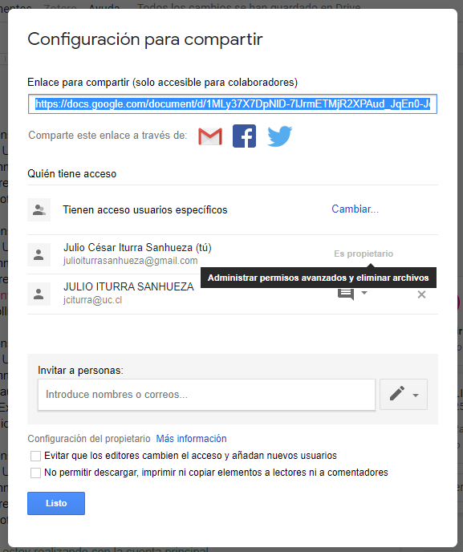

# Google Docs

Google docs es un procesador de texto gratuito que es parte de los servicios online gratuitos que ofrece Google al interior de su plataforma Google Drive. A través de este servicio es posible elaborar documentos online, donde es posible realizar colaboraciones de más de un usuario de manera simultánea.

 

## Cuenta de Google

El primer paso para comenzar a trabajar con un documento en Google Docs es contar con una cuenta de [Google](https://www.google.com/?hl=es_419) (en mi caso es julioiturrasanhueza@gmail.com). De esta manera, podremos acceder a todos los servicios de Google, incluyendo Gmail, Drive y Google Docs. Teniendo una cuenta, se abre la posibilidad de que otras personas nos inviten a participar de la edición y/o lectura de sus documentos online.

## Google Docs

En la Figura 1 muestra los pasos a seguir para iniciar sesión en nuestra cuenta de Gmail. Luego, se muestra que en cuadro de 'Apps' {width=3%}, seleccionamos el símbolo de Google Docs {width=2.5%}. Así, ya podemos crear nuestro nuevo documento (o participar en el de alguien más)

 


## Crear el primer documento

En el punto anterior iniciamos sesión e ingresamos a Google Docs. En la Figura 2, estamos creando nuestro primero documento. Le pusimos un nombre y creamos el primer título.


## Formas de colaborar

Dentro de un proyecto en Google Docs, existen **tres tipos de permisos** de usario:

1. **Puede comentar:** Se pueden realizar comentarios al documento, no obstante no es posible realizar ediciones al texto principal.
2. **Puede editar:** Es posible realizar cambios al texto en su totalidad, no requiere de permisos particulares.
3. **Puede ver:** Puede visualizar el contenido del documento, pero no tiene permisos de edición ni para hacer comentarios.

La Figura 3 nos muestra la manera en que podemos compartir a otros usuarios nuestro documento. En este momento es cuando determinamos los permisos que cada usuario tendrá en el documento. La pestaña que se depliega, nos muestra las alternativas de **Puede comentar**, **Puede editar** y **Puede ver**.


## Aceptar invitación a editar

En este ejemplo, invitaré a otro usuario (jciturra@uc.cl) a colaborar en el documento creado anteriormente por mi cuenta personasl (julioiturrasanhueza@gmail.com). La Figura 4 muestra cómo invitar a otro usuario y luego aceptar la invitación.


## Edición del documento

Luego de aceptar la invitación a editar el documento, usando la cuenta jciturra@uc.cl, realizaremos algunos cambios en el documento.

Como se ve en la Figura 5, el primer paso es activar las 'sugerencias' en la esquina superior derecha. Luego de esto podemos comenzar a editar el documento a través de sugerencia de edición, la idea es **siempre activar las sugerencias**. De lo contrario, estaremos editando directamente el documento, lo cual dificulta realizar un seguimiento de _quién hace qué_.


## Control sobre la edición

Generalmente un proyecto tiene al menos una persona que tiene el rol de aceptar las ediciones que realizan otros usuarios. Google Docs le llama "Propietario" del documento. En la Figura 6 podemos observar que el usuario julioturrasanhueza es el propietario del documento jciturra es el usuario invitado a editar.

{width=50%}

> **Lo ideal es que un usuario se mantenga con un control total de los comentarios y la edición del documento.**

> **Es fundamental que los usuarios 'secundarios' solamente tengan permiso para 'comentar'**

{width=50%}

1. Con este tipo de permiso el 'Propietario' es el único que puede aceptar los cambios.
2. Usuarios con permiso para  'Comentar' sugieren cambios en el texto y/o realizan comentarios, pero **no pueden aceptar cambios**.

```{r eval=FALSE, include=FALSE}
rmarkdown::render(input = "colabdocs.Rmd",output_file = "index.html",encoding = "UTF-8")
```
